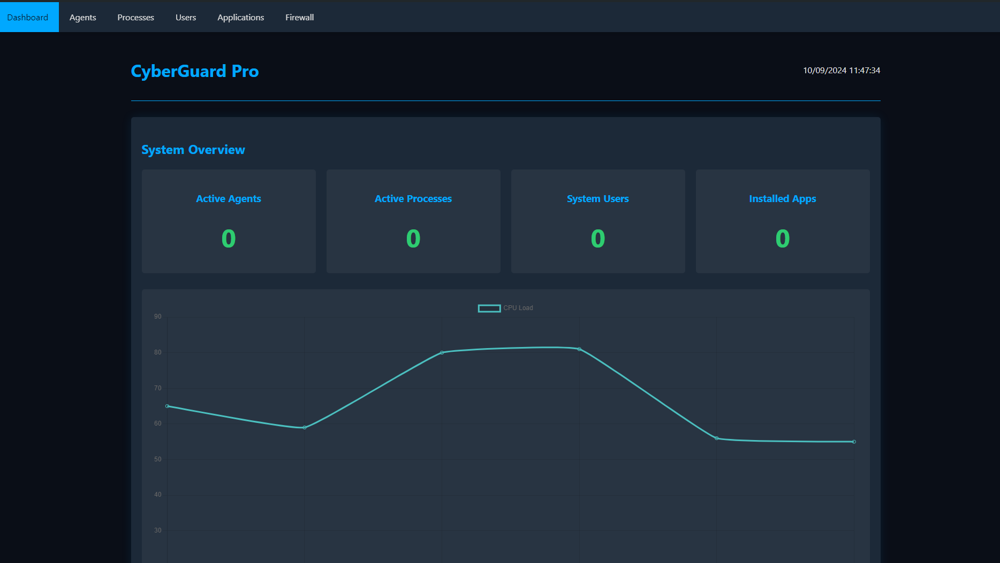
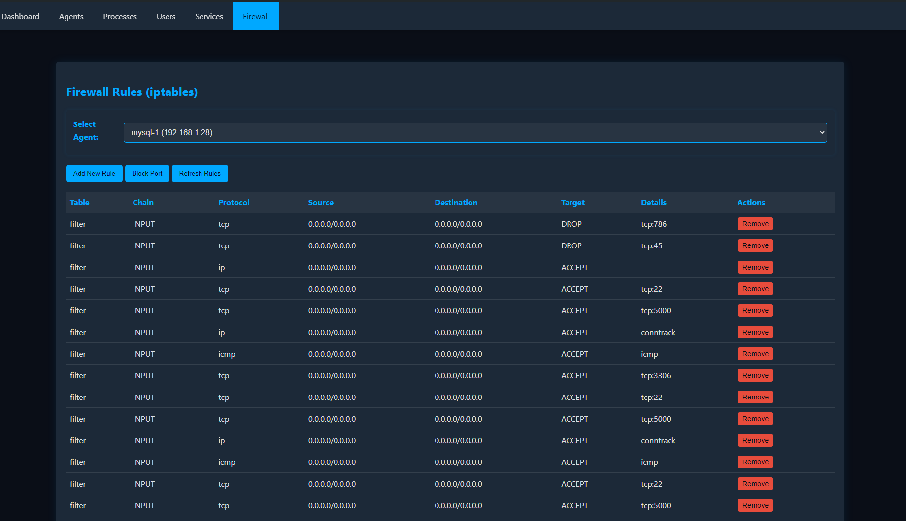

# Server Management Dashboard

A centralized dashboard for comprehensive server management, including firewall rules, server activity monitoring, user management, service tracking, and processor performance analysis.






## Table of Contents


## Features

- **Firewall Management**: View and modify firewall rules across multiple servers.
- **Server Activity Monitoring**: Real-time tracking of server performance and events.
- **User Management**: Centralized control over user accounts and permissions.
- **Service Tracking**: Monitor and manage running services on all connected servers.
- **Processor Performance**: Real-time CPU usage and performance metrics.

## Installation

```bash
git clone [ https://github.com/yourusername/server-management-dashboard.git](https://github.com/jash777/Cyberguard-2)
cd cybergaurdpro
pip install -r requirements.txt
```

## Usage

1. Configure your server connections at centralized dashboard.
2. Run the dashboard:

```bash
python app.py
```

3. Access the web interface at `http://localhost:5001`.

## Configuration

Edit `config.yml` to add your server details:

```yaml
servers:
  - name: mysql Server
    host: 192.168.1.100
    port: 3306
    username: admin
```

## Dependencies

- Python 3.8+
- Flask
- psutil

## Contributing

Contributions are welcome! Please feel free to submit a Pull Request.

## License

This project is licensed under the MIT License - see the [LICENSE](LICENSE) file for details.

## Support

For support, contact  at Twitter @alpha_sec79.
